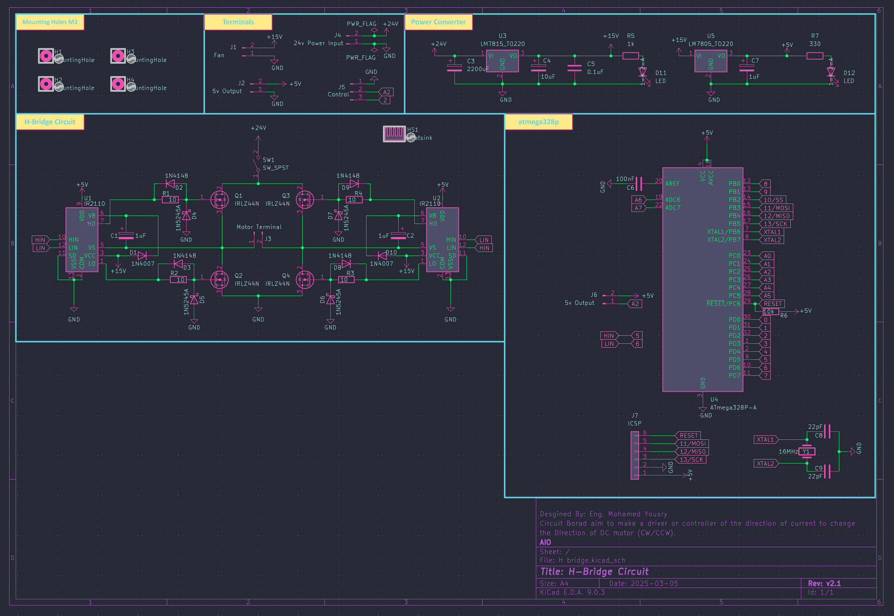
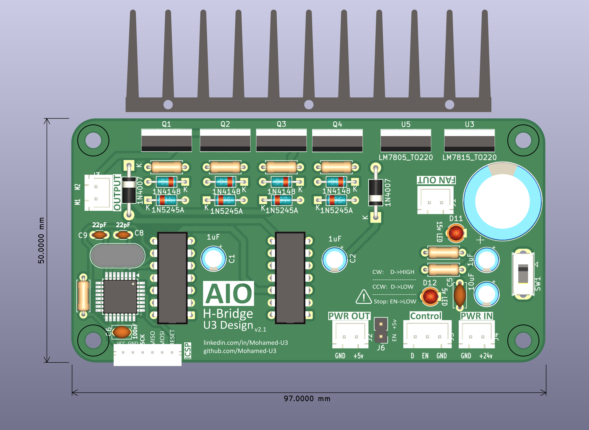

# H-Bridge Motor Control PCB

A professional H-bridge motor driver PCB designed for bidirectional DC motor control with 24V power supply and microcontroller-based control interface.

## Overview

This H-bridge circuit board enables bidirectional control of DC motors with overcurrent protection, isolated gate drivers, and integrated power regulation. The design features high-current MOSFETs capable of handling significant motor loads with proper heat dissipation.

**Designer:** Eng. Mohamed Yousry
**Company:** AIO
**Revision:** v2.1
**Date:** 2025-03-05

## Features

- **Power Supply:** 24V input with integrated voltage regulation

  - 24V → 15V regulation (LM7815) for gate drivers
  - 24V → 5V regulation (LM7805) for logic circuits
  - On-board 5V power distribution terminals
- **Motor Control:**

  - Full H-bridge configuration for bidirectional motor control
  - High-current IRLZ44N MOSFETs (47A Id, 55V Vds, 22mΩ Rds)
  - Motor terminal connector for easy connection
  - Power switch for main 24V supply
- **Gate Drivers:**

  - Dual IR2110 high/low side MOSFET drivers
  - Bootstrap capacitors for high-side gate driving
  - Isolated control signals (HIN/LIN)
- **Microcontroller Interface:**

  - ATmega328P-A microcontroller with arduino Framework (Arduino nano) (TQFP-32)
  - 16MHz crystal oscillator
  - ICSP programming header (6-pin)
  - Control interface connector (3-pin: GND, A2, 2)
- **Protection:**

  - Diode protection on all MOSFET gates (1N4148)
  - Zener diodes for voltage clamping (1N5245A)
  - Bootstrap diodes (1N5820 Schottky)
  - Freewheeling diodes (1N4007) for motor protection
- **Additional Features:**

  - Cooling fan connector (2-pin)
  - Heatsink mounting provision (125x35x50mm)
  - 4x M3 mounting holes for PCB installation
  - Status LEDs with current limiting resistors
  - Multiple power output terminals (5V, 15V)

## Technical Specifications

### Power Ratings

- **Input Voltage:** 24V DC
- **Regulated Outputs:**
  - 15V @ 1A (for gate drivers)
  - 5V @ 1A (for logic circuits)
- **Motor Current:** Up to 47A continuous (per MOSFET rating)
- **Switching Frequency:** Determined by microcontroller PWM (pin D5, D6)

### Key Components

- **MOSFETs:** 4× IRLZ44N (TO-220)
- **Gate Drivers:** 2× IR2110 (DIP-14)
- **Microcontroller:** ATmega328P-A (Arduino Nano) (TQFP-32)
- **Voltage Regulators:** LM7815, LM7805 (TO-220)
- **Crystal:** 16MHz (HC18-U)

## Schematic Sections

1. **Mounting Holes (M3):** Four 3.2mm mounting holes for secure PCB installation
2. **Terminals:** Power input, fan control, and auxiliary 5V outputs
3. **H-Bridge Circuit:** Four-quadrant MOSFET bridge with gate drivers
4. **Power Converter:** Voltage regulation from 24V to 15V and 5V
5. **ATmega328P:** Microcontroller with programming interface and I/O

## Pin Configuration

### Control Connector (J5)

| Pin | Function | Description                             |
| --- | -------- | --------------------------------------- |
| 1   | GND      | Ground reference                        |
| 2   | A2       | Analog control input for the speed      |
| 3   | 2        | Digital control input for the Direction |

### ICSP Programming Header (J7)

| Pin | Function |
| --- | -------- |
| 1   | RESET    |
| 2   | 13/SCK   |
| 3   | 11/MOSI  |
| 4   | 12/MISO  |
| 5   | GND      |
| 6   | +5V      |

### Motor Terminal (J3)

- 2-pin screw terminal for motor connection
- Motor polarity reversal controlled by H-bridge switching

## Operation

The H-bridge operates by controlling four MOSFETs in two half-bridge configurations:

- **Forward:** Q1 & Q4 ON, Q2 & Q3 OFF
- **Reverse:** Q2 & Q3 ON, Q1 & Q4 OFF
- **Brake:** All MOSFETs OFF or Q1 & Q3 ON (or Q2 & Q4 ON)

The IR2110 gate drivers provide isolated high and low-side gate drive signals with:

- **HIN (High-side Input):** Controls top MOSFETs (Q1, Q3)
- **LIN (Low-side Input):** Controls bottom MOSFETs (Q2, Q4)

The ATmega328P generates PWM signals for speed control and direction logic.

## Assembly Notes

- Use thermal paste when mounting MOSFETs to heatsink
- Ensure proper orientation of polarized components (electrolytic capacitors, diodes, LEDs)
- Bootstrap capacitors (C1, C2: 1μF) must be close to VB pins of IR2110
- Power supply bulk capacitor (C3: 2200μF) should be positioned near 24V input
- Verify all ground connections before applying power

## Heatsinking

The design includes provision for a 125x35x50mm heatsink with three M3 mounting points. All four MOSFETs should be thermally coupled to the heatsink using thermal compound and insulating pads if required.

## PCB Specifications

- **Board Size:** A4 (determined by KiCad export)
- **Layers:** 2-layer design
- **Mounting:** 4× M3 holes (3.2mm diameter)
- **Power Traces:** Heavy copper recommended for motor current paths

## Programming

The ATmega328P can be programmed via the ICSP header using an AVR programmer:

the code if included.
